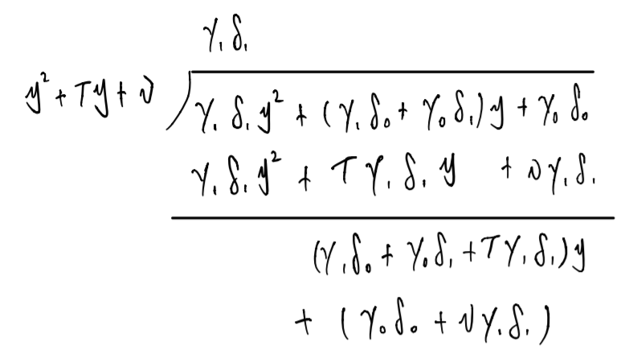
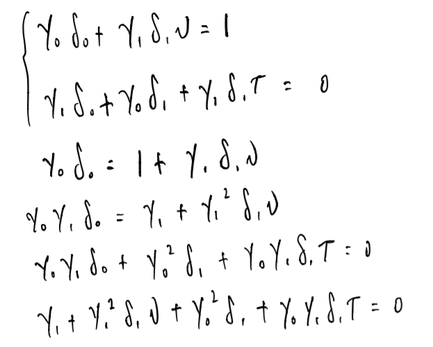
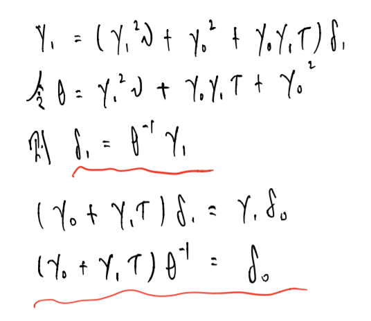
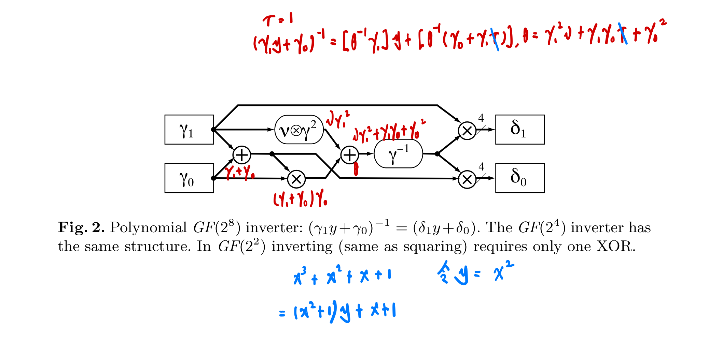

## A Very Compact S-box for AES
1. Introduction\
   略.

2. The S-box Algorithm Using Subfield Arithmetic(1)\
   论文设计的 S-box 对于一个输入字节 (8-bit 向量) $a$ 分两步计算输出:
   1. *Inverse(取逆)*: 令 $c=a^{-1}$, 即求 $a$ 在 $GF(2^8)$ 上的逆 (若 $a=0$, 则 $c=0$).
   2. *Affine Transformation(放射变换)*: S-box 的输出为 $s=Mc\oplus b$, 如下图所示 (其中所有的操作都是在模 2 意义下的):
   $$
       \left[
          \begin{matrix}
             s_7\\ s_6\\ s_5\\ s_4\\ s_3\\ s_2\\ s_1\\ s_0
          \end{matrix}
       \right]
        =
        \left[
           \begin{matrix}
              1&1&1&1&1&0&0&0\\
              0&1&1&1&1&1&0&0\\
              0&0&1&1&1&1&1&0\\
              0&0&0&1&1&1&1&1\\
              1&0&0&0&1&1&1&1\\
              1&1&0&0&0&1&1&1\\
              1&1&1&0&0&0&1&1\\
              1&1&1&1&0&0&0&1\\
           \end{matrix}
        \right]
        \left[
           \begin{matrix}
              c_7\\ c_6\\ c_5\\ c_4\\ c_3\\ c_2\\ c_1\\ c_0
           \end{matrix}
        \right]
        \oplus
        \left[
           \begin{matrix}
              0\\1\\1\\0\\0\\0\\1\\1
           \end{matrix}
        \right]
    $$
   第 2 步的实现较为简单，略过不表. 本论文重点研究第 1 步, 即如何设计一种算法, 快速地求解出 $a$ 在 $GF(2^8)$ 上的逆.
   
3. The S-box Algorithm Using Subfield Arithmetic(2)\
   本论文的 AES 是在有限域 $GF(2^8)$ 上讨论的 (即其输入输出均为 8-bit 0/1 序列). 可以将这个序列看成是多项式的系数 (这种表示方法叫做 多项式基 (*polynomial basis*)), 所进行的多项式乘法是在模不可约多项式 $q(x)=x^8+x^4+x^3+x+1$ 意义上的, 系数加法需要模 2. 令 A 为 q(x) 的根, 则 标准多项式基 (*the standard polynomial basis*) 为 $[A^7,A^6,A^5,A^4,A^3,A^2,A,1]$.
   直接计算一个 7 次多项式的逆并不简单, 故本论文提出了一种间接计算的算法, 其基本思路就是用一种类似分治的算法将 $GF(2^8)$ 上的计算转化成 $GF(2^4)$ 上的计算, 再进一步转化到 $GF(2^2)$, $GF(2)$.

4. The S-box Algorithm Using Subfield Arithmetic(3): 分治?
   1. 不懂的点——关于基(*basis*)? 关于正规基(*normal basis*)? 关于多项式基(*polynomial basis*)? 关于迹(*trace*)? 关于范数(*norm*)?
   2. 符号约定:
      1. 大写罗马字母(拉丁字母)代表 $GF(2^8)$ 中的元素;
      2. 小写希腊字母代表 $GF(2^4)$ 中的元素;
      3. 大写希腊字母代表 $GF(2^2)$ 中的元素;
      4. 小写罗马字母(拉丁字母)代表 $GF(2)$ 中的元素.
   3. 将 $GF(2^8)$ 上的一个元素 $G$ 表示成 $y(\in GF(2^4))$ 的线性多项式: $G=\gamma_1 y+\gamma_0$ (模不可约多项式 $r(y)=y^2+\tau y+\nu$). 此时可以用 $[\gamma_1 ,\gamma_0]$ 来表示 $G$ (从多项式基 $[Y,1]$ 的角度来表示, 其中 $Y$ 是 $r(y)$ 的一个根).\
   与此同时, 我们能利用 $r(y)$ 的两个根 $[Y^{16},Y]$ 来构造 正规基(*normal basis*) $[Y^{16},Y]$, 即 
      $$r(y)=y^2+\tau y+\nu=(y+Y)(y+Y^{16}) \tag{1}$$ 
      因此, $\tau=Y+Y^{16}$ 是 $Y$ 的 迹(*trace*), 而 $\nu = (Y)(Y^{16})$ 是 $Y$ 的  范数(*norm*).
   4. 将 $GF(2^4)$ 上的元素表示成 $z(\in GF(2^2))$ 的线性多项式, 如 $\gamma=\Gamma_1 z+\Gamma_0$ (模不可约多项式 $s(z)=z^2+\Tau z+\Nu$, 其中 $\Tau$ 和 $\Nu$ 为大写希腊字母). 此时多项式基为 $[Z,1]$, $Z$ 为 $s(z)$ 的根; 或我们可以使用正规基 $[Z^4,Z]$, 即 $s(z)=z^2+\Tau z+\Nu=(z+Z)(z+Z^4)$. 其中 $T$ 是 $Z$ 的迹, 而 $N$ 是 $Z$ 的范数.
   5. 同理有: $\Gamma=g_{1} w+g_{0}, w\in GF(2)$ (模不可约多项式 $t(x)=w^2+w+1$). 此时多项式基为 $[W,1]$, $W$ 为 $t(w)$ 的根, 正规基为 $[W^2,W]$, $W$ 的迹和范数均为 1.
   6. 总结: 将 $GF(2^8)$ 上的操作转化到了最简单的 $GF(2^2)$ 上. 另外, 在所有的这些有限域中, 加法(和减法)都等价于位异或.
      
5. The S-box Algorithm Using Subfield Arithmetic(4)\
   现在开始考虑 $GF(2^8)$ 上的多项式基之间的乘法 (模 $r(y)=y^2+\tau y+\nu$):
   $$(\gamma_1 y + \gamma_0)(\delta_1 y + \delta_0) = \gamma_1 \delta_1 y^2 + (\gamma_1 \delta_0 + \gamma_0 \delta_1)y + \gamma_0 \delta_0=(\gamma_1 \delta_0+\gamma_0 \delta_1+\gamma_1 \delta_1 \tau)y+(\gamma_0 \delta_0+\gamma_1 \delta_1 \nu)$$
   具体推导: 
   
   由此可进一步推导出逆的计算公式:
   $$(\gamma_1 y+\gamma_0)^{-1}=[\theta^{-1}\gamma_1]y+[\theta^{-1}(\gamma_0+\gamma_1 \tau)], \theta=\gamma_1^{2}\nu+\gamma_1 \gamma_0 \tau+\gamma_0^{2}$$
   具体推导:
   
   
   
6. The S-box Algorithm Using Subfield Arithmetic(5)\
   合理地设置 $r(y)=y^2+\tau y+\nu,s(z)=z^2+\Tau z+\Nu$ 的系数有助于简化公式, 而这其中最有效的方式是令二者的迹统一, 因此从现在开始, 我们令 $\tau=\Tau=1$. 

7. Hierarchical Structure\
   这部分展示最优设计的求逆器的结构. 用 $\oplus,\otimes$ 分别表示子域中的加法和乘法. 在 $GF(2^8)$, 唯一要求的操作是求逆, 其多项式基求逆器如下图所示:\
   

8. 123