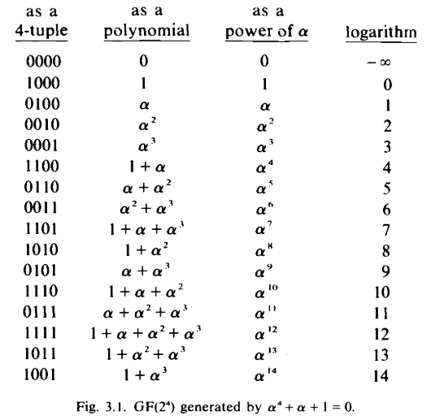
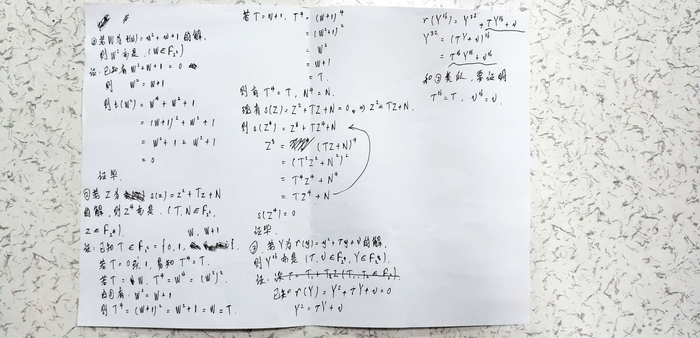

# Tower field representation
1. 现有 $F_2 = \{0,1\}$. 则 $F_{2^k}$ 可由一个不可约多项式 $q(x)$ 得到. 关于这个 $q(x)$:
   1. 其最高次项的次数为 $k$;
   2. 各项系数的取值范围: $F_2=\{0,1\}$.
2. 假设 $X$ 是 $q(x)$ 在域 $F_{2^k}$ 上的一个根, 则 $F_{2^k}$ 中的所有元素可以表示成线性组合 $b_{k-1}X^{k-1}+...+b_{1}X+b_{0},\ where\ b_{0},b_{1},...,b_{k-1} \in F_2$, 这被称为 *"a polynomial basis of $F_{2^k}$ over $F_2$"*.
3. 例子\
\
可以看到: $q(x) = x^4+x+1$ 是 $F_2$ 上的一个不可约多项式, 其最高次为 4. 现有 $\alpha$ 为域 $F_{2^k}$ 上的一个根 (即 $\alpha^4+\alpha+1=0$ ), 则 $F_{2^k}$ 中的所有元素可以表示成线性组合 $b_{k-1}\alpha^{k-1}+...+b_{1}\alpha+b_{0}$.
4. 关于Tower Field的一个证明\
\