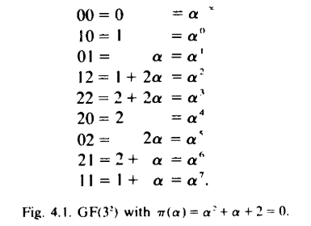

1. 域\
   表达形式: $GF(p), p 为质数.$
2. 若域 E 包含域 F, 则称 E 是 F 的扩展.
3. 不可约(irreducible) [此处讨论的多项式的系数都是在 GF(p) 中的]\
   若一个多项式不能分解成两个度 (degree) 更低的多项式的乘积，则称这个多项式为不可约多项式.
4. 定理1\
   现有 $\pi(x)$ 是 GF(p) 上的不可约多项式, 度为 m. 所有 [x 的次数小于或等于 (m-1)] 并且 [系数出自域 GF(p)] 的多项式和在模 $\pi(x)$ 意义下的加减乘除等操作, 组成了一个序(order) 为 $p^m$ 的域.
5. 只有一个域满足序为 $p^m$, 它被称为一个伽罗瓦(Galois)域, 表示为 $GF(p^m)$. $GF(p^m)$ 中的任何一个成员都可以写成一个 m 元组 (该 m 元组中的任一元素都来自 GF(p)).

6. 扩展到无限域\
   (看不太懂)
7. 有限域的例子\
   使用 $GF(3)$ 上的不可约多项式 $\pi(x)=x^2+x+2$, 可获得 $GF(3^2)$, 如下图所示.\

8. 123